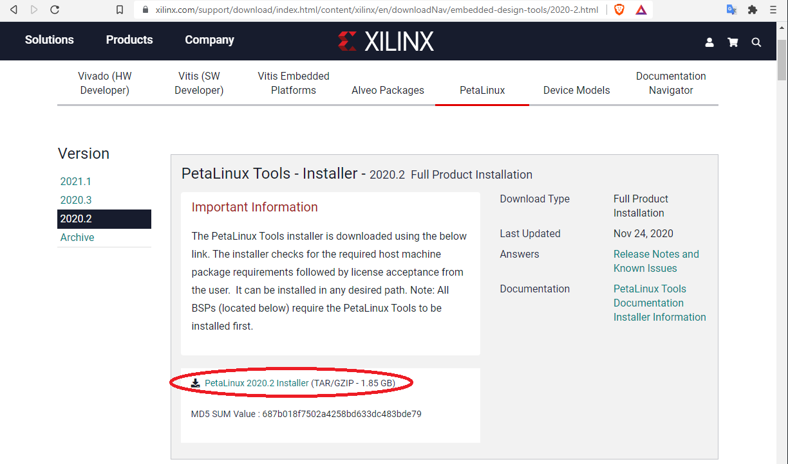
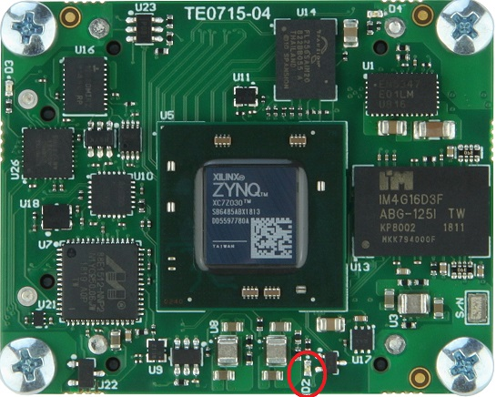

# Building PetaLinux SD card image for Hastlayer (Trenz TE0715-04-30-1C module)

To be able to run Hastlayer accelerated .NET applications on Trenz Electronics TE0715-04-30-1C Zynq 7030 SOM SoC module you have to build PetaLinux with certain features enabled. This document describes the required steps.

## Install Xilinx PetaLinux Tools 2020.2

Download PetaLinux 2020.2 installer from [Xilinx website](https://www.xilinx.com/support/download/index.html/content/xilinx/en/downloadNav/embedded-design-tools/2020-2.html) and install it. 



PetaLinux building requires a 64-bit Linux machine with supported RedHat 7-8, CentOS 7-8, or Ubuntu 16-18-20. The actual PetaLinux tools installation must be done as a regular user, but for installing the required packages you need root access too. For more details see [the documentation](https://www.xilinx.com/content/dam/xilinx/support/documentation/sw_manuals/xilinx2021_1/ug1144-petalinux-tools-reference-guide.pdf).

> ℹ️ If you are using the Centos 7 Docker image you don't have a regular root user. Perform the following to create a very regular user called "user" and to install all software dependencies:
> ```shell
> function user-setup() {
>     # Creates non-root user and lets it take over /data.
>     useradd user && passwd user && usermod -G wheel user || return
>     chown user:user /data -R
>     locale-gen en_US.UTF-8 && update-locale
>     echo 'export LANG=en_US.UTF-8' >> /home/user/.bashrc
>      
>     # Installs the necessary dependencies.
>     yum install -y git diffstat unzip texinfo python chrpath wget xterm sdl rpcsvc-proto socat cpio inetutils python2 net-tools tftp-hpa python-virtualenv xorg-server-xvfb bison flex gnupg ncurses autoconf libtool tar gcc sdl sdl2 glib2 screen pax pax-utils libstdc++5 python-django iproute2 lib32-zlib openssl gawk python-pexpect python-pip python-gitpython python-jinja xz iputils python-pylint ncurses-devel gcc-c++ xfce4-terminal
>     
>     # Logs you in as "user".
>     su user
> }
> 
> user-setup
> ```
> 
> If there were no issues this have just logged you in as "user". Next move the installer to your home directory:
> ```shell
> cd
> mv /data/petalinux-*-installer.run ~
> ```

Continue with the PetaLinux installation:

```shell
./petalinux-v2020.2-final-installer.run --dir ~/petalinux20202 --platform "arm"
```

If everything was all right the above command will prompt you with several licence viewers. Naturally you carefully read through each navigating with <kbd>PageDown</kbd> and then exiting with <kbd>Q</kbd>.

Before using the PetaLinux tools you first have to set up the environment:

```shell
source ~/petalinux20202/settings.sh
echo '. ~/petalinux20202/settings.sh' >> ~/.bashrc
```

> ℹ️ Pay attention to this output, as it will notify you if you are lacking free space, have network connection problems, or missing any dependencies. Don't worry about the not supported OS warning though.

## Configuring and building PetaLinux images

Create an empty PetaLinux project based on Zynq template:

```
cd ${HOME}/trenz_te0715_04_30_1c
petalinux-create -t project --template zynq --name petalinux
```

Configure the hardware:

```
cd petalinux
petalinux-config --silentconfig  --get-hw-description=${HOME}/trenz_te0715_04_30_1c/vivado/test_board/vivado
```

Configure the kernel:

```
petalinux-config -c kernel
```


Set "Kernel Configuration - Device Drivers - Staging drivers - Xilinx PL clock enabler" option to [*] built-in.
Press the ESC key and save the configuration before exit.

Replace ./project-spec/meta-user/recipes-bsp/device-tree/files/system-user.dtsi file with the following:

```
/include/ "system-conf.dtsi"
/ {
    fclk0: fclk0 {
    status = "okay";
    compatible = "xlnx,fclk";
    clocks = <&clkc 15>;
    };
};

&amba {
  zyxclmm_drm {
    compatible = "xlnx,zocl";
    status = "okay";
  };
};
```

Edit ./project-spec/meta-user/conf/petalinuxbsp.conf and add the following lines at the end:

```
EXTRA_IMAGE_FEATURES = "debug-tweaks"
IMAGE_AUTOLOGIN = "1"
```

Edit ./project-spec/meta-user/conf/user-rootfsconfig and add the following lines at the end:

```
CONFIG_opencl-clhpp-dev
CONFIG_opencl-headers-dev
CONFIG_xrt
CONFIG_zocl
```

Configure the root filesystem:

```
petalinux-config -c rootfs
```


In "user packages" group choose [*] built-in option for all items.

Press the ESC key and save the configuration before exit.

Build the SD card images:

```
petalinux-build
petalinux-package --boot --force --fsbl --u-boot --fpga
```

## Preparing the SD card

Copy the following three files to the root folder in the first partition on the SD card (it should be less than 32 GB and FAT32 formatted):

```
./images/linux/BOOT.BIN
./images/linux/boot.scr
./images/linux/image.ub
```

The BOOT.BIN and the boot.scr contains the U-Boot and the initial FPGA image. The image.ub contains the kernel and the root file system.

If required you can put additional content on the SD card, and after booting PetaLinux you can access the SD card content in cd /media/sd-mmcblk0p1/ folder.

To run Hastlayer accelerated .NET applications you should log in as root (the default password is root).



To test the SD card image put the card into the Micro SD card slot on the carrier board. After switching on the power, the D2 LED becomes green, and if the FPGA is successfully programed from SD card it will goes off.
