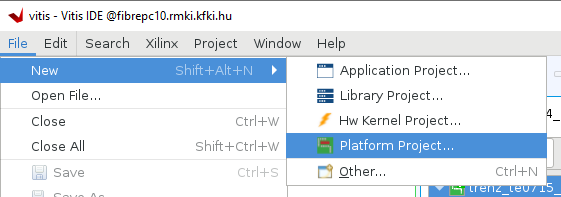
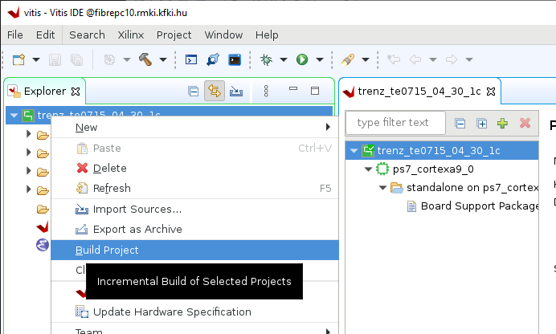

# Building Vitis XPFM platform for Hastlayer (Trenz TE0715-04-30-1C module)

To be able to generate Vitis XCLBIN files (containing the Hastlayer RTL kernel) for Trenz Electronics TE0715-04-30-1C Zynq 7030 SOM SoC module you have to generate the Vitis XPFM platform based on the prevously generated Vivado XSA file. This document describes the required steps.
 
Before using the Vitis tools you first have to set up the environment:
 
```
source /tools/Xilinx/Vitis/2020.2/settings64.sh
```

Create an empty folder and launch Vitis GUI:

```
mkdir ${HOME}/trenz_te0715_04_30_1c/vitis
cd ${HOME}/trenz_te0715_04_30_1c/vitis
vitis
```

> ⚠️ If it fails to start up check if you see any of these errors:
> * _libGL error: failed to load driver: swrast_ install mesa-libGLw. On CentOS type `sudo yum install -y mesa-libGLw-devel.x86_64`.
> * _process 19030: D-Bus library appears to be incorrectly set up; failed to read machine uuid_ type `sudo bash -c 'sudo dbus-uuidgen > /var/lib/dbus/machine-id'`

Set Workspace to: ${HOME}/trenz_te0715_04_30_1c/vitis

Create a new platform project:

File - New - Platform Project...



Platform project name: trenz_te0715_04_30_1c

XSA File: ${HOME}/trenz_te0715_04_30_1c/vivado/test_board/vivado/zsys_wrapper.xsa

Uncheck "Generate boot components"

Build the project.



The path for the generated XPFM file:

```
${HOME}/trenz_te0715_04_30_1c/vitis/trenz_te0715_04_30_1c/export/trenz_te0715_04_30_1c/trenz_te0715_04_30_1c.xpfm
```
