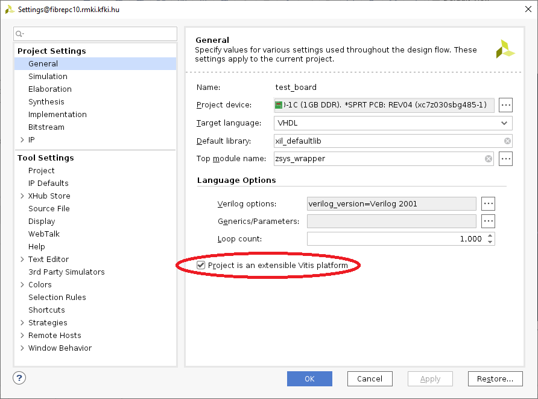

# Building Vivado XSA (Xilinx Shell Archive) file for Hastlayer (Trenz TE0715-04-30-1C module)

To start with the Hastlayer on the Trenz TE0715-04-30-1C module you first need to build a Vivado XSA file containing the appropriate Zynq Processing System (ARM CPU) and FPGA fabric configuration. This document describes the required steps.

## Install Vitis Core Development Kit 2020.2

> ℹ️ If you are using the Centos 7 Docker image you already have the development kit and can skip this section.

Download the Vitis Core Development Kit 2020.2 installer (Vivado included) from Xilinx website: (https://www.xilinx.com/support/download/index.html/content/xilinx/en/downloadNav/vitis/2020-2.html) and install it. 


You can install Vitis and Vivado as root user in the default /tools/Xilinx folder.

Before using the Vivado tools you first have to set up the environment:

```
source /tools/Xilinx/Vitis/2020.2/settings64.sh
```

## Downloading and configuring the reference design for TE0715-04-30-1C module

Create an empty directory, then download and extract the reference design from Trenz Electronic:

```
mkdir ${HOME}/trenz_te0715_04_30_1c
cd ${HOME}/trenz_te0715_04_30_1c
mkdir vivado
cd vivado
wget https://shop.trenz-electronic.de/trenzdownloads/Trenz_Electronic/Modules_and_Module_Carriers/4x5/TE0715/Reference_Design/2020.2/test_board/TE0715-test_board-vivado_2020.2-build_5_20210611100936.zip
unzip TE0715-test_board-vivado_2020.2-*.zip
```


## Configure the reference design (command line part)

```
cd ${HOME}/trenz_te0715_04_30_1c/vivado/test_board
source _create_linux_setup.sh
```

In the command line menu first press "0" (Module selection guide, project creation...). Wait until the module list apears. Then type in "AN", ENTER, "TE0715-04-30-1C", ENTER to select the apropriate module. Then answer "Y",  and press "2" at the end to create the Vivado project.

Wait until the Vivado GUI is done with the initial block design creation.

## Configure the reference design for Hastlayer (Vivado GUI part)

Change the project type to Vitis extensible platform on Project Settings - General tab:



Import the external constraint files into the project to be able to export the XSA file. Right-click on Constraint(5) filegroup and choose "Add Sources..."


Be sure that "Copy constraints files into project" settings are checked, and press "Finish".


### Configure the "ZYNQ7 Processing System"

Set FCLK_CLK0 to 150 MHz:


Enable iinterrupt requests from fabric:


### Extend the block design with the Concat and Reset IP

Right-click on the block design and add "Concat" and "Processor System Reset" IPs.

Make connection between:

xlconcat_1:dout[1:0] -> PS:IRQ_F2P[1:0]

PS:FCLK_CLK0 -> proc_sys_reset_0:slowest_sync_clk
PS:FCLK_RESET0_N -> proc_sys_reset_0:ext_reset_in


###Configure the "Platform Setup" pages

Enable M_AXI_GP0 and S_AXI_HP0:


Enable FCLK_CLK0:


Enable interrupt In0 .. In7:


## Export the XSA file

Build the bitfile before exporting XSA by pressing the "Generate Bitstream" in Flow Navigator.

After successfully building the bitfile press "Export Platform" in Flow Navigator. The platform type should be hardware only / pre-synthesis / include bitfile.

The path for the generated XSA file:

```
${HOME}/trenz_te0715_04_30_1c/vivado/test_board/vivado/zsys_wrapper.xsa
```

