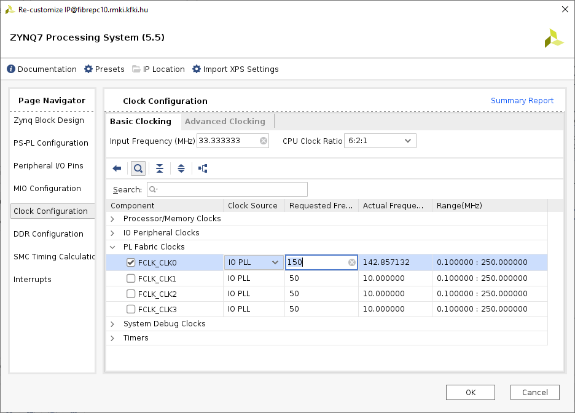

# Building Vivado XSA (Xilinx Shell Archive) file for Hastlayer (Trenz TE0715-04-30-1C module)

To start with the Hastlayer on the Trenz TE0715-04-30-1C module you first need to build a Vivado XSA file containing the appropriate Zynq Processing System (ARM CPU) and FPGA fabric configuration. This document describes the required steps.

## Install Vitis Core Development Kit 2020.2

> ℹ️ If you are using the Centos 7 Docker image you already have the development kit and can skip this section.

Download the Vitis Core Development Kit 2020.2 installer (Vivado included) from Xilinx website: (https://www.xilinx.com/support/download/index.html/content/xilinx/en/downloadNav/vitis/2020-2.html) and install it. 


You can install Vitis and Vivado as root user in the default /tools/Xilinx folder.

Before using the Vivado tools you first have to set up the environment:

```
source /tools/Xilinx/Vitis/2020.2/settings64.sh
```

## Downloading and configuring the reference design for TE0715-04-30-1C module

Create an empty directory, then download and extract the reference design from Trenz Electronic into it. As of 2024 the latest file can be found [here](https://shop.trenz-electronic.de/trenzdownloads/Trenz_Electronic/Modules_and_Module_Carriers/4x5/TE0715/Reference_Design/2022.2/test_board/TE0715-test_board-vivado_2022.2-build_2_20230705115102.zip). But if that link is outdated, please follow these instructions:

1. Go to the [TE0715 Resources page](https://wiki.trenz-electronic.de/display/PD/TE0715+Resources) in the Trenz Electronic Wiki.
2. Click the _Download area_ link.
3. Follow this path: Reference_Design → 2022.2 → test_board.
4. Download the archive in the _Reference Design - Source Code and Configuration Files_ section.


## Configure the reference design

This part is launched from the command line but requires an X11 graphical environment. If you are using Docker from Windows, see the _Using Graphical Applications on a Windows Host_ section of our Docker documentation in the _Hast.Vitis.Abstractions_ project.

```
cd ${HOME}/trenz_te0715_04_30_1c/vivado/test_board
bash _create_linux_setup.sh
```

In the command line menu: 
- Press "0". (Module selection guide, project creation...)
- Wait until the module list apears.
- Type in `AN`, then press <kbd>enter</kbd>.
- Type `TE0715-04-30-1C`, then press <kbd>enter</kbd> to select the apropriate module.
- Answer `Y`, and then `2` at the end to create the Vivado project.

Wait until the Vivado GUI is done with the initial block design creation.

## Configure the reference design for Hastlayer (Vivado GUI part)

- Click the Tools > Settings menu.
- Select Project Settings > General from the sidebar.
- Tick the _Project is an extensible Vitis platform_ checkbox.
- Click the Ok button.


Import the external constraint files into the project to be able to export the XSA file. Right-click on the Constraints group and choose "Add Sources..."


Be sure that "Copy constraints files into project" settings are checked, and press "Finish".


### Configure the "ZYNQ7 Processing System"

* Click on IP INTEGRATOR > Open Block Design from the left sidebar.
* Double click on the "processing_system7_0" component (the block with the ZYNQ logo).
* Go to the Clock Configuration on the side menu.
* Find PL Fabric Clocks > FCLK_CLK0 and change it from 50 to 150.



* Go to Interrupts on the side menu.
* Tick the Fabric Interrupts.
* Tick Fabric Interrupts > PL_PS Interrupt Ports > IRQ_F2P.
* Click Ok.


### Extend the block design with the Concat and Reset IP

* Right-click on the block design.
* Select Add IP.
* Type "Concat" into the search bar and click on the result.
* Do the same for "Processor System Reset" too.

Make connection between:

* `xlconcat_1:dout[1:0]` -> `processing_system7_0:IRQ_F2P[1:0]`
* `processing_system7_0:FCLK_CLK0` -> `proc_sys_reset_0:slowest_sync_clk`
* `processing_system7_0:FCLK_RESET0_N` -> `proc_sys_reset_0:ext_reset_in`


### Configure the "Platform Setup" pages

Enable M_AXI_GP0 and S_AXI_HP0:


Enable FCLK_CLK0:


Enable interrupt In0 .. In7:


Save and close the Block Design tab.

## Export the XSA file

* Click PROGRAM AND DEBUG > Generate Bitstream on the sidebar.
* Press Yes on the prompt and Ok on the dialog box.
* You need to wait for synthesis and implementation. You can track the progress on the Project Summary panel.
* Eventually a dialog will pop up telling you that the implementation has completed. You can close it.
* Click IP INTEGRATOR > Export Platform on the sidebar.
* Click Next until you reach the Platform State where you need to tick the Include bitstream box. Then click Next until the end and then Finish.
   * Note that you can see the path on the Output File page, it should be the same as below.

The path for the generated XSA file:

```
${HOME}/trenz_te0715_04_30_1c/vivado/test_board/vivado/zsys_wrapper.xsa
```

